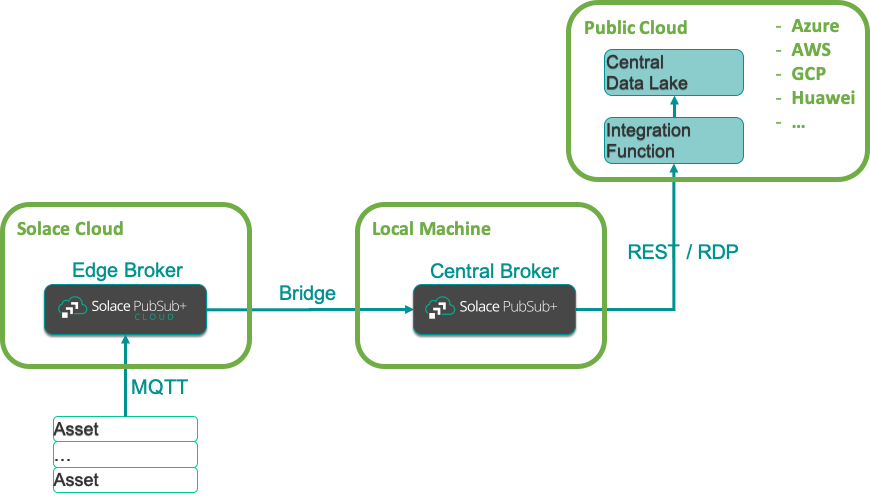
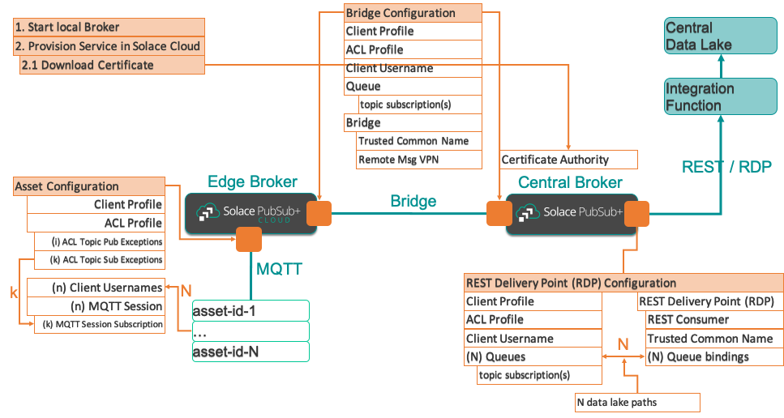

# Project Overview

The goal of this project is to show the configuration of a global Solace Event Mesh that:
* allows IoT assets installed all over the world to connect and stream data to a regional Edge Broker (assets like HVACs, Windmills, Power generators, Elevators, etc)
* connects all the Edge Brokers to a Central Broker that aggregates data streams from every connected asset
* pushes the data streams to an Integration Function which inserts the data into a Data Lake

Here, we'll limit the scope to 1 Edge Broker and 1 Central Broker.

## Topics

#### Data Streams

Assets publish streaming data using the following topic pattern:

  `{domain}/{asset-type-id}/{asset-id}/{region-id}/{data-type-id}`

where:

|topic_element|fixed|dynamic|description|example(s)|
|-----------------:|:---:|:---:|:---|:---|
|{domain}|x||project domain|`as-iot-assets`|
|{asset-type-id}||x|asset type|`hvac-123`, `power-gen-456`|
|{asset-id}||x|assigned unique id to the asset, interpreted as: asset-id, device-id, client-id, client-username|`XYZ1234-987-ux`|
|{region-id}||x|the region id the asset is deployed in|`us`, `cn`, `eu`|
|{data-type-id}|enumerated|x|the specific data stream type|`stream-metrics`, `stream-metrics-2`, `stream-metrics-3`|

#### Configuration

The Device Management System publishes configuration updates for devices using the following pattern:

  `{domain}/{asset-id}/config/{config-type-id}`

where `{config-type-id}` is the type of configuration update published.

Assets subscribe to configuration updates.

#### ACL Profile: Topic Exceptions

In the ACL Profile for the assets, we disallow subscribing & publishing by default and
add the following exceptions:

Publish Topic Exceptions:
  - `as-iot-assets/*/$client-id/*/stream-metrics`
  - `as-iot-assets/*/$client-id/*/stream-metrics-2`
  - `as-iot-assets/*/$client-id/*/stream-metrics-3`

Subscribe Topic Exceptions:
  - `as-iot-assets/$client-id/config/*`

where the `$client-id` is substituted at run-time with the MQTT client id, which is the asset's device id.

## Dynamic mapping of topics to Data Lake paths

In order to map the topics the assets use to publish their data streams dynamically to a data lake path, we use the following mechanism:

- define 1 queue per data lake path
  - add 1 topic subscriptions to the queue
- create 1 RDP with 1 REST Consumer
  - add 1 queue binding per queue
    - each queue binding passes the path information in the URL when calling the Integration Function

In the Integration Function:
- read the path from the URL
- update the data lake with the event under the path

## Broker Configurations

In order to set up the above Mesh and the logic,
we configure the following objects / elements on the Brokers:

---
The End.
