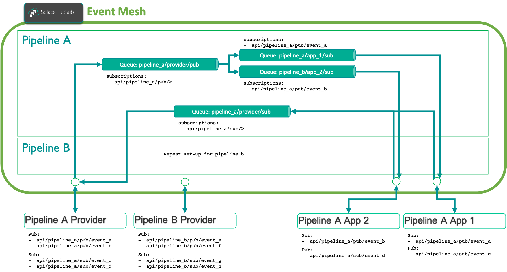
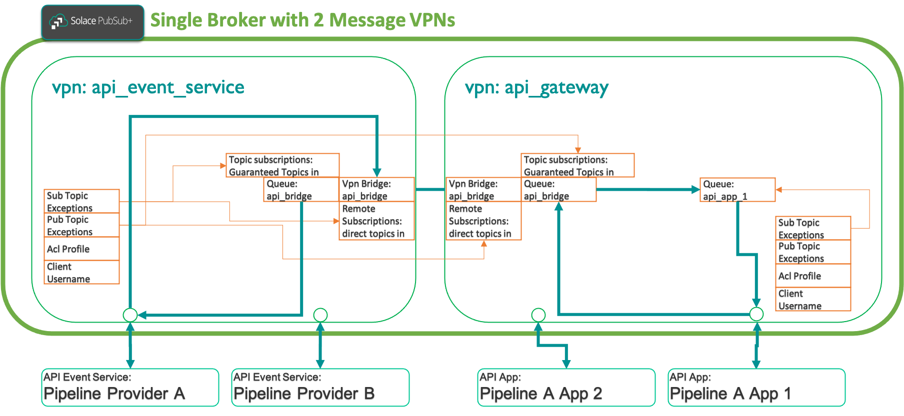

# Project Overview

This project describes an example set-up of **_persistent event processing pipelines_**, where:
- a **_Pipeline Provder_** generates multiple events to be processed
- 1 or many **_Pipeline Apps_** process a configured sub-set of the generated pipeline events
- the **_Pipeline Apps_** can also send responses, e.g. in the form of status updates, to the **_Pipeline Provider_**

> Note that the topic schema queue naming schema used in this example includes the keywords `pub` and `sub`. In a real scenario, this would not
> be the case and is used here for illustration purposes only.

The following figure shows the overall concepts:

## Configuration Details

The implementation approach chosen is derived from the concept of Async API Management, where:
- **_API Event Services_** act as the providers of an API
- **_API Apps_** act as the consumers of an API
- the concept of an **_API_** acts as an interface definition between API Event Services and API Apps
- API Apps **_subscribe_** and **_unsubscribe_** to/from APIs - at which point the configuration for the API is provisioned / de-provisioned on the Gateway Broker

In addition, we physically separate the Brokers into two layers:
- an **_API Event Service Broker_** where provider applications connect to, and
- an **_API Gateway Broker_**, where consumer applications connect to

> Note: for simplification purposes, this project uses 1 Broker instance with 2 Message VPNs.

The implementation concepts are:
- describe each API Event Service in a configuration file and use a standardized playbook for the creation or removal
- describe each API in a configuration file
- describe each API App in a configuration and use a set of standardized playbooks to either create or remove the App
  - an API App can subscribe to 1 or multiple APIs
  - an API App can be configured to only subscribe / publish to a subset of available events described in the API
- keep a set of files that reflect the current state of all configured API Event Services and Apps

In particular:
- ensure each API Event Service and each App can be managed separately
- ensure access and flow of events are controlled
- create an audit log trace for each playbook, including each SEMP call, organize by timestamp, playbook, broker, and vpn

The configured objects on the message VPNs are:

---
